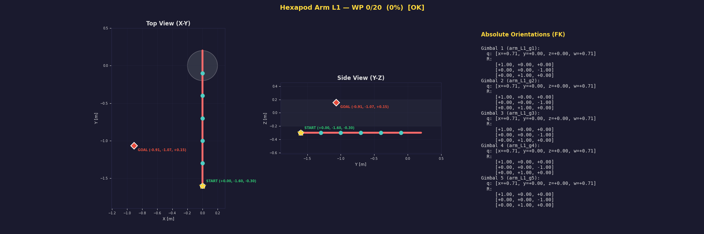

# Hexapod Arm Robot Simulation

ROS 2 Humble, Gazebo (Ignition), および MoveIt 2 を使用した「6脚（ジンバル関節アーム）ロボット」のシミュレーション環境です。

## 概要

### ロボット仕様
| 項目 | 値 |
|------|-----|
| アーム数 | 6本（左3 + 右3） |
| 1アームあたりの構造 | 円柱6本 + ジンバル関節5個 |
| 円柱パーツ | 長さ 30cm, 半径 4cm |
| ジンバル関節 | 球体（半径 6cm）, 3DOF (Roll/Pitch/Yaw) |
| 関節可動域 | ±90° (±1.57 rad) |
| 総自由度 | 90 DOF（15 DOF × 6アーム） |
| 胴体 | 半径 20cm, 長さ 1m の円柱 |

* **ジンバル関節**: URDFの制限を回避し、線形代数学における特異点（ジンバルロック）の検証を可能にするため、同一座標にある直交する3つの回転関節（Roll → Pitch → Yaw）として定義されています。
* **干渉チェック**: 同一アーム内の連続パーツ（物理的に接続されたセグメント）は除外し、非隣接パーツ間および胴体との幾何学的距離計算で検証しています。

---

## 起動・使用手順

ROS 2 を使用する全ての新しいターミナルでは、最初に以下のセットアップコマンドを実行してください。

### 1. ワークスペースのビルドと環境のロード
初回実行時、またはソースコードを変更した際は必ずビルドしてください。
```bash
source /opt/ros/humble/setup.bash
cd ~/robot
colcon build --symlink-install
source install/setup.bash
```

---

###  2. ロボットモデルの単体表示 (RViz2)
ロボットモデルの形状や、ジンバル関節の動きをGUIスライダーから手動でテストするための Launch です。

```bash
ros2 launch hexapod_arm_bot_description display.launch.py
```
* **結果**: RViz2 が自動で開き、画面中央にロボットが表示されます。同時に開く `joint_state_publisher_gui` のスライダーを動かすことで、全54ジョイントを個別に操作でき、ジンバルロックとなる特異姿勢の確認等が行えます。

---

### 3. Gazebo 物理シミュレータの起動
物理シミュレーション上でコントローラと MoveIt を起動するための Launch です。

```bash
ros2 launch hexapod_arm_bot_gazebo sim.launch.py
```
* **結果**: 空の Gazebo ワールドにロボットが生成され、アーム制御用の `ros2_control` コントローラと MoveIt (`move_group`) が起動状態になります。

---

### 4. ランダム姿勢 軌道計画テスト
`ik_test.py` は **ROS / Gazebo 不要** の純粋 Python スクリプトです。単体で実行できます。

```bash
cd ~/robot
python3 ik_test.py
```

**処理内容:**
1. ランダムな目標関節角度を生成（±36°、干渉しにくい範囲に制限）
2. 干渉チェック付きで有効な姿勢を自動選定（最大10回リトライ）
3. **順運動学 (FK)** を4×4変換行列で計算し、手先の初期位置・目標位置を表示
4. 関節空間での線形補間で **20ウェイポイントの軌道** を生成
5. 各ウェイポイントで **自己干渉・胴体干渉チェック** を実施
6. 軌道サマリーを表形式で出力
7. **GIFアニメーション** を生成し `~/robot/trajectory_animation.gif` に保存



**GIFアニメーション内容:**
| マーカー | 意味 |
|---------|------|
| 🟢 緑の丸 | START（初期手先位置 + XYZ座標） |
| 🔴 赤いダイヤ | GOAL（目標手先位置 + XYZ座標） |
| ⭐ 黄色い星 | 現在の手先位置 |
| 黄色の破線 | 手先の軌跡トレイル |
| 赤い太線 | アームの円柱パーツ |
| ティール色の丸 | ジンバル関節（球体） |

**現在の対象アーム:** `arm_L1`（左第1アーム）のみ

---

## 今後の拡張予定

- [ ] 全6アーム（`arm_L1` 〜 `arm_L3`, `arm_R1` 〜 `arm_R3`）への対応
- [ ] 複数アーム同時制御時のアーム間干渉チェック
- [ ] 逆運動学 (IK) ソルバーの自前実装（MoveIt KDL に頼らない数値解法）
- [ ] Gazebo 上でのリアルタイム軌道再生
- [ ] ジンバルロック検出・警告機能

---

## ディレクトリ構成
```
~/robot/
├── ik_test.py                          # 軌道計画テストスクリプト（純粋Python）
├── setup.sh                            # 初期セットアップスクリプト
├── trajectory_animation.gif            # 生成されるGIFアニメーション
├── src/
│   ├── hexapod_arm_bot_description/    # URDF / xacro モデル定義
│   ├── hexapod_arm_bot_gazebo/         # Gazebo Launch / コントローラ設定
│   └── hexapod_arm_bot_moveit_config/  # MoveIt 設定 (SRDF, kinematics等)
```
